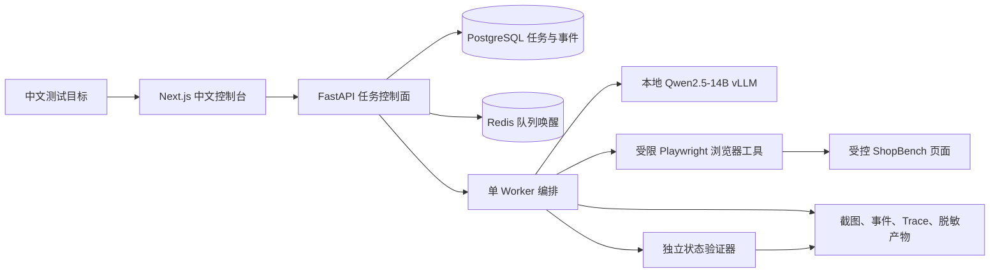

# WebPilot-QA：可验证浏览器智能体

> 面向 Web 测试与任务自动化的 LLM Agent 工程项目：将自然语言目标转化为受控浏览器操作，并使用独立验证器检查真实页面状态。

## 中文演示

- [01｜中文智能体完整闭环](docs/demo/videos/01_中文智能体完整闭环.mp4)：中文任务创建、智能体执行、状态验证、截图与 Trace。
- [02｜14B 实时评测与证据](docs/demo/videos/02_14B实时评测与证据.mp4)：本地 14B 模型、实时回归结果与可追溯产物。

## 项目解决什么问题

传统网页自动化依赖固定 CSS/XPath，页面轻微变化就可能失效；而仅依赖模型自述“任务完成”又会带来误判。WebPilot-QA 通过结构化页面观察、受限工具调用、独立状态验证、有限恢复和人工审批，把浏览器智能体做成可追溯的工程闭环。

## 核心能力

- **规划与执行**：将自然语言测试目标转换为有步骤和完成条件的任务计划。
- **受限浏览器工具**：仅允许白名单操作；模型不能执行任意 JavaScript、Shell 命令或原始选择器。
- **独立验证器**：读取真实控件和页面状态，而不是接受模型的完成声明。
- **恢复与自愈定位**：针对短暂失败和页面元素变化执行有上限的恢复。
- **安全审批**：高风险动作和敏感输入必须进入人工确认，不会自动越权。
- **可追溯控制面**：FastAPI、PostgreSQL、Redis、SSE、截图、Trace 和脱敏产物共同保存运行证据。
- **中文控制台**：可查看任务状态、计划、事件、验证证据、浏览器截图和产物文件。

## 架构



详细说明：[系统架构](docs/ARCHITECTURE_CN.md)｜[Demo 操作](docs/DEMO_CN.md)｜[运行与评测状态](docs/RUN_STATUS_CN.md)｜[面试说明](docs/INTERVIEW_CN.md)。

## 已验证证据

| 项目 | 已验证结果 | 证据 |
| --- | --- | --- |
| 自动化测试 | 109 通过，3 项环境相关跳过 | 项目测试记录 |
| 中文 Demo 回归 | E05、E29 共 2/2 通过，均为 `live_model` | [Day14 报告](docs/demo/evidence/day14/summary.md) |
| E29 购物车回归 | 2 次工具调用、0 次重试，通过真实购物车状态验证 | Day14 `report.json` |
| 14B 严格 100 任务基线 | 11 通过、26 安全拦截、63 失败 | [Day13 严格基线](docs/demo/evidence/day13/strict-100-report.json) |
| 消融任务切片 | 完整方案 3/5；移除恢复后 2/5；单智能体 0/5 | [Day13 等预算消融](docs/demo/evidence/day13/ablation.md) |

### 指标边界与限制

- Day14 的 E05/E29 为**实时 Demo 回归**，用于证明当前运行时、模型、工具调用和页面验证闭环可用；它不等于通用网页任务成功率。
- Day13 的 100 任务严格结果发生在最后一轮质量修复前，是用于定位问题的诊断基线，不能作为修复后的最终性能结论。
- 当前项目是单 GPU、单 Worker 的工程原型；浏览器上下文隔离不等价于操作系统级沙箱。
- 所有公开 Demo 均使用受控 ShopBench，不涉及真实账号、真实支付或外部生产网站。

## 快速开始

```bash
# 运行自动化测试
./.venv/bin/python -m pytest -q

# 启动受控网页
./.venv/bin/python scripts/run_shopbench.py --port 8080

# 启动 API
./.venv/bin/python -m uvicorn webpilot.service.api:create_app --host 127.0.0.1 --port 8000

# 启动控制台
PATH="$PWD/.tools/node/bin:$PATH" ./.tools/node/bin/npm --prefix console run dev
```

真实模型运行需要额外配置本地 vLLM 服务，并通过 `LLM_BASE_URL`、`LLM_API_KEY` 和 `LLM_MODEL` 指向 OpenAI 兼容接口。请勿提交模型权重、私有运行配置、数据库密码或 API Key。
