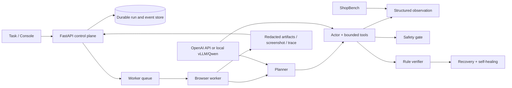

# WebPilot-QA architecture

The console is read-only with respect to run truth: it renders API state and SSE events. Browser actions are restricted to structured tools; high-risk side effects require an approval fingerprint. The worker is the only component that owns browser execution.
